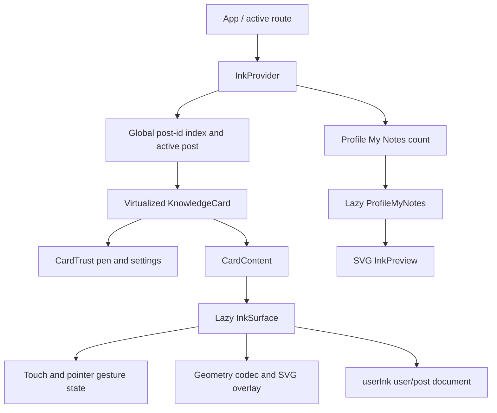
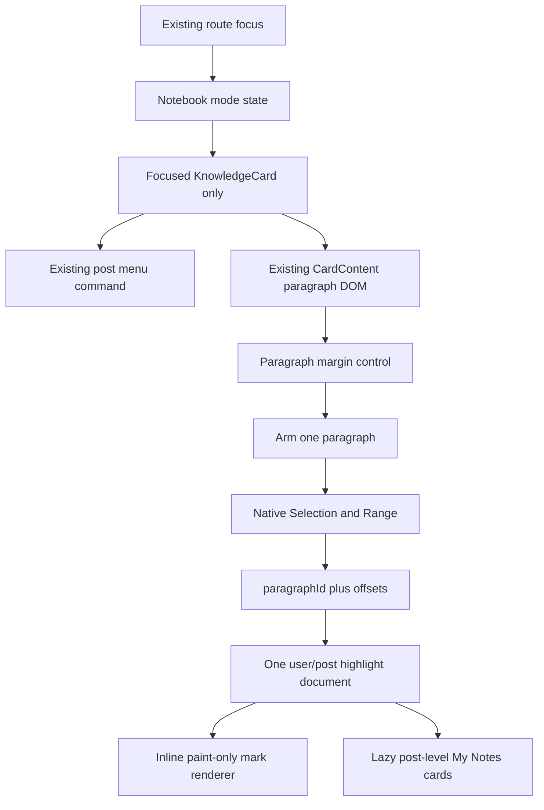

# Readative Release Y.2 — Notebook Highlight V2 Architecture

Date: 2026-07-03

Status: Architecture audit and proposal only; no implementation has started

## Scope and audit basis

This document audits the live `main` branch at Release Y.1 (`56cb0bc`) and the last pre-Ink Highlight implementation at Release X.2 (`7793a6b`). The distinction matters: the current runtime no longer contains a semantic Highlight system. It contains freehand vector Ink, while the former `userHighlights` data remains archived in Firestore and the former implementation remains in Git history.

No production source, dependency, route, Firestore data, rule, index, or generated asset was changed during this audit.

## Executive finding

Release Y.1 is optimized as a drawing feature, but drawing is the wrong abstraction for Release Y.2. It introduces a 537-line gesture surface, SVG projection, geometry encoding, resize observation, per-stroke writes, pen preferences, and vector previews. Those systems do not contribute to semantic text highlighting.

Y.2 should replace the drawing pipeline with a focused-post, paragraph-scoped native selection pipeline:

1. Highlight-specific chrome is absent during normal reading.
2. The existing post actions menu is the non-persistent entry point for Highlight Mode.
3. Highlight Mode shows only tiny, paragraph-owned controls in the existing left card gutter.
4. Tapping a margin control arms exactly one paragraph.
5. Native browser selection produces a semantic range.
6. The range is stored as paragraph identity plus character offsets in one user/post document.
7. Yellow marks are rendered inline with paint-only styling; no overlay or geometry participates.

The existing card DOM, paragraph splitting, grey separators, text metrics, card height, feed rank, routes, and virtualization algorithm remain unchanged.

## Current architecture map



### Former semantic Highlight architecture

The pre-Y.1 Highlight implementation is not live, but it is the closest semantic predecessor and its archived data may be migratable.

| Area | Former behavior | Audit result |
| --- | --- | --- |
| Global state | `HighlightsProvider` stored every highlight for the signed-in user and a `Record<postId, boolean>` mode map | Allowed multiple cards to remain armed and caused global updates |
| Firestore | One top-level `userHighlights` document per selected range; one user-wide `onSnapshot` query | Unbounded listener payload and violates Y.2's one-document-per-post rule |
| Selection | `onMouseUp` and `onTouchEnd` read `window.getSelection()` | Semantic and responsive, but touch finalization and cross-paragraph ranges were under-specified |
| Range | `paragraphIndex`, `startOffset`, `endOffset`, and duplicated `selectedText` | Responsive, but numeric paragraph identity drifts after edits |
| Rendering | Recursive `highlightReactTree` wrapped matching text with `<mark>` | Correct direction, but its padding and border could change line wrapping and card height |
| Card work | Every mounted card filtered the complete global highlight array by `postId` | `O(visible cards × user highlights)` work on every provider update |
| Removal | Clicking a mark opened `window.confirm`, then deleted one Firestore document | Functional but sentence-oriented rather than post-oriented |
| Profile | `ProfileHighlights` grouped by post but rendered every selected sentence | Did not satisfy the post-card-only My Notes requirement |

The old architecture should not be restored wholesale. Only its semantic range principle and DOM text-offset lessons should be reused.

### Live Y.1 Ink ownership

| File | Current responsibility | Y.2 disposition |
| --- | --- | --- |
| `src/context/InkContext.tsx` | Active Ink post, global annotated-post ID set, color and width preferences, lazy index load | Replace drawing state with route-scoped Highlight Mode; retain only a compatibility index seam required by protected `Profile.tsx` |
| `src/ink/types.ts` | Stroke, anchor, geometry, color, and width schema | Remove from active runtime |
| `src/ink/blockKey.ts` | Hashes normalized paragraph source and duplicate occurrence | Generalize the small deterministic paragraph-ID idea |
| `src/ink/geometry.ts` | Simplifies, quantizes, encodes, decodes, and projects stroke points | Remove |
| `src/ink/InkSurface.tsx` | Loads Ink, arbitrates gestures, builds strokes, saves, observes layout, renders SVG | Remove |
| `src/ink/InkPreview.tsx` | Renders up to 24 strokes in a notebook-like SVG preview | Replace with one small yellow text preview |
| `src/ink/repository.ts` | Reads index/post docs, appends strokes, pages My Notes, deletes notes | Replace with semantic highlight repository; preserve bounded paging and canonical post hydration |
| `CardTrust.tsx` | Persistent pen button plus long-press color/width popover | Remove all drawing controls |
| `CardContent.tsx` | Paragraph DOM, block anchors, lazy Ink surface host | Preserve paragraph and separator DOM; replace content-sized surface with paragraph selection |
| `KnowledgeCard.tsx` | Connects context, focus, button, overlay, header indicator, status | Connect route-scoped Highlight Mode without changing card layout |
| `CardHeader.tsx` | Shows an Ink crayon indicator for annotated posts | Remove the persistent indicator; use its existing actions menu only as the mode entry seam |
| `ProfileMyNotes.tsx` | Pages one Ink document per post, hydrates posts, draws SVG previews | Reuse card/page shell; render title, author, date, one yellow preview, and count |

## Firestore audit

### Archived Highlight storage

Path: top-level `userHighlights/{autoId}`

Fields included `userId`, `postId`, `selectedText`, `paragraphIndex`, `startOffset`, `endOffset`, duplicated post title/author, and `createdAt`. One selection created one document. The provider listened to all matching documents for the user.

The Y.1 migration archived these documents in place. Current source does not query them.

### Live Ink storage

Paths:

- `userInk/{uid}`: schema version, `postIds`, and update time.
- `userInk/{uid}/posts/{postId}`: schema version, creation/update time, and a `strokes` array.

Current access cost:

| Event | Reads | Writes | Highlight/Ink listener |
| --- | ---: | ---: | --- |
| Signed-in identity becomes active | 1 index document | 0 | None |
| Feed card render | 0 | 0 | None |
| Focus/activate Ink on one post | 1 post document | 0 | None |
| First completed stroke | 0 after load | 2 batched writes: post + user index | None |
| Later completed stroke | 0 after load | 1 post-document write | None |
| My Notes first/load-more page | Up to 12 Ink docs plus one bounded post query | 0 | None |
| Delete a post's Ink | 0 | 2 batched writes: post + user index | None |

Every completed stroke adds a write. No write occurs during pointer movement. `arrayUnion` avoids resending the local array as application data, but the stored document grows with every stroke.

No Firestore rules or index configuration is present in this repository, so ownership enforcement and deployed rule coverage cannot be verified locally. Rule validation is a release prerequisite, not an assumption.

## SVG and overlay rendering audit

The focused Ink surface mounts only when the focused post is active or known to have Ink. It renders one absolute, content-sized SVG with `pointer-events: none`. Committed strokes are grouped into at most 15 `<path>` elements (five colors by three widths), plus one active path.

Positive properties:

- Feed cards do not mount Ink SVGs.
- The SVG is absolute and does not directly change content height.
- Live path mutation is limited to animation-frame cadence.
- React state changes once per completed stroke rather than once per point.

Costs and bottlenecks:

- `renderedGroups` performs layout reads (`getBoundingClientRect`) during render.
- It scans blocks for each stroke, decodes geometry, allocates point arrays, and rebuilds large path strings after each stroke or resize.
- Every pointer sample reads the host rectangle.
- Each live frame rebuilds a path string from all accumulated raw points, so work grows through the gesture.
- The SVG covers the entire text region, increasing paint area even when only a small stroke changes.
- `ResizeObserver` invalidates the complete projection when the content host changes size.
- My Notes renders one SVG per loaded note card. Load More accumulates every page in memory and DOM; the page is not virtualized.

Y.2 requires no SVG or content overlay. Inline yellow background paint is the only highlight rendering.

## Pointer and gesture audit

The live `InkSurface` has separate touch and non-touch pointer paths:

- Touch hold: 280 ms.
- Mouse/pen hold: 140 ms.
- Pre-hold movement tolerance: 8 CSS pixels.
- Minimum committed stroke distance: 6 CSS pixels.
- Raw gesture cap: 1,024 points; persisted cap: 256 points.
- A non-passive `touchmove` listener is attached only after a successful hold.

Conflict risks:

- A browser may commit a touch to scrolling before the late non-passive listener can take control.
- `preventDefault()` after the hold creates an unavoidable scroll-versus-draw boundary.
- Mouse/pen events are attached to the host without pointer capture; release outside the host can be missed.
- Text selection is disabled in active Ink Mode, opposing the Y.2 goal.
- Links and mentions share the content region and require explicit click-versus-selection handling.
- Context menu/callout suppression can interfere with native touch selection.
- Gesture listeners, timers, live refs, cancellation paths, and layout reads exist solely because the feature is drawing vectors.

Y.2 must use the browser Selection/Range APIs and must not call `preventDefault()` on paragraph drag, install drawing listeners, capture pointers, or change `touch-action`. Desktop drag selection is expected. Mobile browsers may require their normal long-press and selection handles; custom one-drag touch selection would reintroduce scroll arbitration and is rejected unless separately approved.

## Feed virtualization audit

`KnowledgeCardList` is a custom variable-height virtual list:

- Initial estimated card heights are derived from image count/layout and text metadata.
- Only the viewport plus 900 px overscan is mounted.
- Rows are absolutely positioned inside a total-height container.
- Each mounted row is measured with `ResizeObserver`.
- A height change above the viewport triggers compensating `window.scrollBy` to prevent a jump.
- Rows use `contain: layout paint`.
- Firestore pagination loads 10 posts initially and 5 subsequently; virtualization is separate from pagination.

Current Ink mostly avoids feed cost by limiting SVG rendering to the focused card. It still makes every mounted `KnowledgeCard` consume the global Ink context, so active mode, preferences, or the annotated-post set can invalidate all visible consumers. The temporary in-card Ink status message also changes card height and forces virtual-row remeasurement.

Y.2 virtualization contract:

- No Highlight renderer, range document read, margin control, or yellow mark mounts on ordinary feed cards.
- Only the focused post can mount the lazy semantic highlight module.
- No in-card success/status panel may be added.
- Margin controls are out-of-flow in the existing gutter.
- `<mark>` styling must have zero padding, margin, border, font, letter-spacing, and line-height effect.
- The measured height before mode, during mode, after selection, and after mode exit must be identical.

## Card and paragraph rendering audit

`KnowledgeCard` is lazy-loaded and memoized. It calculates `contentSections` by splitting `entry.content` on one or more blank lines, trimming each section, and dropping empty sections.

`CardContent` renders:

```text
content host: mt-6, space-y-0
  section wrapper 0
    paragraph
  section wrapper 1+
    divider: my-6 border-t border-slate-100
    paragraph
```

Paragraph classes are `whitespace-pre-wrap` plus a selection class. The divider is the existing grey notebook separator. Its DOM position and classes are a hard invariant.

Rich text is a React tree of text fragments, links, mentions, emphasis spans, and strong text. Therefore offsets must be computed against rendered text nodes, not raw Markdown source indexes. A DOM `TreeWalker` is appropriate for selection capture, and the renderer must apply ranges recursively without altering the rich-text elements.

The old mark style used horizontal padding and a border; that can change wrapping. Y.2 must use paint-only styling such as a yellow background/gradient with `color: inherit`, `padding: 0`, `margin: 0`, and inherited line height.

## Existing indicators audit

Current user-facing Ink indicators are:

- A persistent pen button in `CardTrust`.
- A long-press pen settings popover.
- A crayon glyph in `CardHeader` when a post ID appears in the user index.
- A My Notes tab count sourced from the same index.
- Blue/black/red/green/orange SVG strokes on a focused post.

The first three create visible drawing-product language. Y.2 removes the persistent pen/settings control and header crayon. The already-present three-dot post menu becomes the non-persistent command surface. The My Notes count remains because it is navigation metadata, not in-reading clutter.

## Current My Notes audit

`Profile.tsx` already owns an own-profile-only `notes` section and lazy-loads `ProfileMyNotes`. The profile shell and route remain unchanged.

`ProfileMyNotes` currently:

- Queries 12 `userInk/{uid}/posts` documents ordered by `lastAnnotatedAt`.
- Loads the matching canonical `knowledge` documents in one bounded `documentId in` query.
- Appends further pages without virtualization.
- Shows one card per post.
- Shows title, author, last-annotated date, an SVG vector preview, Continue Reading, and delete-all-Ink.
- Keeps unavailable-post cards and permits deletion.

It already has the correct post-level cardinality and lazy section boundary. Y.2 should reuse those properties, replace SVG with one derived yellow text preview, display the semantic range count, and retain canonical post hydration so title/author/date are not duplicated into highlight documents.

## Performance and complexity findings

| Finding | Severity | Evidence and impact |
| --- | --- | --- |
| Drawing architecture for a reading interaction | High | Geometry, pen settings, SVG, and gesture arbitration are unnecessary for semantic text ranges |
| Layout reads during SVG render | High | Can force synchronous layout and repeats per stroke/block after resize or commit |
| Full path rebuild while drawing | Medium/High | Repeated string and point-array work grows over the gesture |
| One Firestore write per stroke | Medium | Natural for drawing, excessive relative to one semantic selection |
| Growing vector document | High at outliers | Up to 600 strokes and 450,000 client-capped geometry characters plus object overhead |
| My Notes accumulation | Medium/High | Every loaded document retains all strokes; every loaded card retains a preview SVG |
| Global context invalidation | Medium | Visible cards consume active ID, post IDs, color, and width from one value |
| Late touch handoff | High UX risk | Competes with browser scrolling and differs across mobile engines |
| In-card mode/status message | High for Y.2 invariant | Temporarily increases virtual row and card height |
| Former global Highlight listener | High if restored | Loads/listens to all sentence documents and fans updates through all cards |
| Former padded `<mark>` | High for Y.2 invariant | Can change line wrapping, separator position, and card height |

The existing Y.1 performance report measured +0.72 kB gzip in the startup chunk relative to pre-Ink, plus approximately 4.89 kB gzip for the focused Ink path and 4.10 kB gzip for My Notes. Removing geometry/SVG/pen preferences should make Y.2 net-negative against Y.1, but the `< 1 KB gzip` requirement remains a measured release gate rather than an estimate.

## Proposed Y.2 architecture



### State model

| State | Persistent UI | Text behavior |
| --- | --- | --- |
| Normal | No margin controls or highlight-specific card indicator | Stored yellow marks may render on the focused post; ordinary selection remains browser-owned |
| Mode on, no paragraph armed | Tiny controls appear only in the left gutter beside paragraphs | No range is captured |
| Paragraph armed | Only the chosen paragraph is an active capture boundary | Native selection is accepted only inside that paragraph |
| Saving | No spinner or layout insertion | Selected range is optimistically yellow; one write is pending |
| Error | No card-height change | Optimistic range rolls back; a non-layout status is announced |

“Nothing visible” is interpreted as no persistent interaction chrome in normal reading. Previously saved yellow text remains visible on the focused post because it is reading content, not an interaction indicator. If approval intends saved highlights to be hidden outside Highlight Mode, that must be stated explicitly because it changes the usefulness and read behavior of the feature.

### Mode lifecycle

Mode state is in memory only and keyed to the focused post ID. It is cleared when:

- `focusedPostId` becomes `null`.
- `focusedPostId` changes.
- The active application tab changes away from Knowledge.
- The focused post is closed.
- Navigation opens another post without explicitly invoking Highlight Mode.
- The component/provider unmounts on refresh.
- Identity changes or signs out.

The existing route state is consumed; `routes.ts` and route behavior do not change.

### Margin control contract

- One tiny control is rendered per paragraph only while mode is on, because the tap must identify which paragraph becomes selectable.
- It is a sibling of the `<p>`, never a child of the paragraph or divider.
- It is anchored to that paragraph's wrapper and placed in the existing left card padding.
- It is not fixed, sticky, viewport-relative, content-sized, or positioned over text.
- The visible mark is intentionally tiny; the hit target may be taller than the visible mark but must stay out of the text column.
- The paragraph/divider wrapper must retain identical dimensions with the control mounted or absent.
- Keyboard focus and an accessible label identify the paragraph without adding visible text.

### Selection contract

- Tapping a margin control sets `armedParagraphId` and focuses the paragraph boundary.
- A committed selection must be non-collapsed and wholly contained in the armed paragraph.
- Cross-paragraph, reversed-invalid, out-of-range, interactive-control, or empty-whitespace selections are rejected without a write.
- Character offsets are measured across rendered DOM text nodes with `TreeWalker`.
- Pointer/touch defaults are not prevented. No `touch-action`, pointer capture, drawing timer, canvas, SVG, or coordinate hit testing is introduced.
- Link navigation is suppressed only when the completed native selection is non-collapsed; ordinary clicks remain links.
- Exactly one save attempt follows one completed valid selection. `selectionchange` may update local readiness but must not write.
- Browser selection is cleared only after the semantic range has been captured successfully.

### Paragraph identity

Each paragraph receives a deterministic ID generated from normalized source text plus a duplicate-occurrence number. Offsets are against the rendered paragraph text.

This survives responsive reflow, font changes, and card width changes because no pixel positions are stored. If post content changes and the paragraph ID no longer resolves, the range fails closed and is not drawn against unrelated text. Reads never perform automatic heuristic relocation or cleanup writes.

### Proposed document model

Paths:

- `userNotebook/{uid}`: a small per-user index used only for the existing protected My Notes tab count.
- `userNotebook/{uid}/posts/{postId}`: the only highlight document for that user/post pair.

Illustrative schema:

```ts
interface NotebookHighlightRange {
  id: string;
  paragraphId: string;
  startOffset: number;
  endOffset: number;
  color: "yellow";
  createdAt: number;
}

interface NotebookPostDocument {
  schemaVersion: 2;
  createdAt: number;
  updatedAt: number;
  highlights: NotebookHighlightRange[];
}
```

Post title, author, body, rendered HTML, selected sentence, pixels, SVG, paths, canvas data, and screenshots are not stored. Canonical post metadata is loaded from `knowledge` for My Notes.

Ranges are validated and capped well below Firestore's document ceiling. Exact duplicates are ignored. A transaction merges concurrent state and normalizes overlapping/adjacent ranges deterministically before persistence so rendering never creates nested marks. All fields and array sizes are validated again when read.

### Proposed Firestore behavior

| Event | Reads | Writes | Listener |
| --- | ---: | ---: | --- |
| Signed-in identity | 1 lightweight post-ID index read | 0 | None |
| Ordinary feed | 0 per post | 0 | None |
| Focus known highlighted post or activate mode | 1 user/post document | 0 | None |
| Complete first valid highlight on a post | 1 transactional current-document read | 2 committed writes: post + user index | None |
| Complete later valid highlight | 1 transactional current-document read | 1 committed post-document write | None |
| Pointer/selection movement | 0 | 0 | None |
| My Notes page | Up to 12 notebook docs plus one bounded canonical-post query | 0 | None |
| Delete all highlights for a post | 0 | 2 batched writes: post + user index | None |

No additional Firestore listener is introduced. The current Ink and archived Highlight collections remain untouched by normal Y.2 runtime code.

### Inline rendering

The renderer sorts and normalizes valid ranges for one paragraph, walks the existing rich-text React tree, and wraps only matching text fragments in `<mark data-highlight-id>`. Mark CSS is paint-only and inherits all text metrics. No parent dimensions, gaps, separators, or card classes change.

Ordinary feed cards do not load or render marks. The lazy renderer exists only for the focused card, preserving the virtualization path.

### My Notes target

Each document naturally produces one card per post. Each card contains only:

- Canonical title.
- Canonical author.
- Canonical post date.
- One small yellow text preview derived from the first valid range and current post content.
- Highlight count.

It does not list every sentence. The unavailable-post state and delete-all-notes action can remain. SVG preview, pen icon language, and vector geometry are removed.

### Lazy-loading and bundle boundary

- Mode context remains dependency-free and contains only small scalar/Set state.
- Repository code is dynamically imported only for signed-in index load, focused post use, or My Notes.
- The semantic range renderer/selection controller is lazy and focused-post-only.
- My Notes remains lazy behind the existing profile section.
- No dependency is added. Existing `html-to-image` remains isolated to the protected downloader and is not imported by Highlight V2.
- The clean Y.1 startup asset is the bundle baseline; Y.2 must add less than 1.00 kB gzip and is expected to reduce it.

## Protected boundaries

Release Y.2 does not change:

- Feed ranking, personalization, pagination, or virtualization algorithms.
- Downloader/export behavior or dependencies.
- SmartTalk.
- SEO.
- Authentication or identity semantics.
- Profile layout, profile data, or profile routing.
- Explore.
- Notifications.
- Route definitions or navigation semantics.
- Global performance architecture.

`Profile.tsx` is protected. Its existing lazy My Notes seam and `inkPostIds.size` count dependency create a compatibility constraint. The approved implementation should keep a tiny internal compatibility export that maps that count to Y.2 highlighted-post IDs, allowing `Profile.tsx` itself to remain unchanged. This internal alias must not leak Ink language into the UI or storage schema.

## Architecture acceptance conditions

Architecture is ready for approval only with these interpretations:

1. “Nothing visible” means no persistent interaction chrome; stored yellow marks remain readable on a focused post.
2. The existing three-dot menu is the mode entry point, avoiding a persistent Highlight button.
3. Touch uses native browser selection behavior; no custom drawing-like drag recognizer is permitted.
4. One small margin control per paragraph is necessary to identify the paragraph being armed.
5. Legacy semantic highlights may be validated and migrated; freehand Ink cannot be safely converted and remains archived.
6. No implementation starts until these documents are approved.
